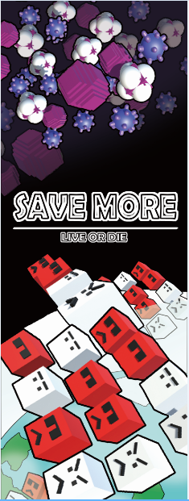
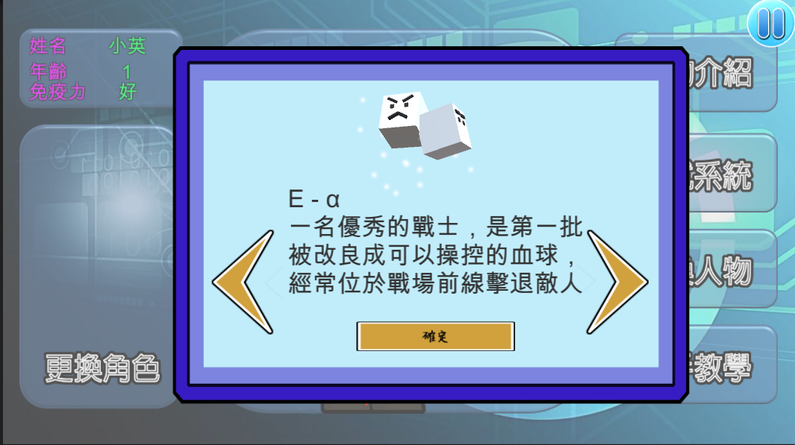
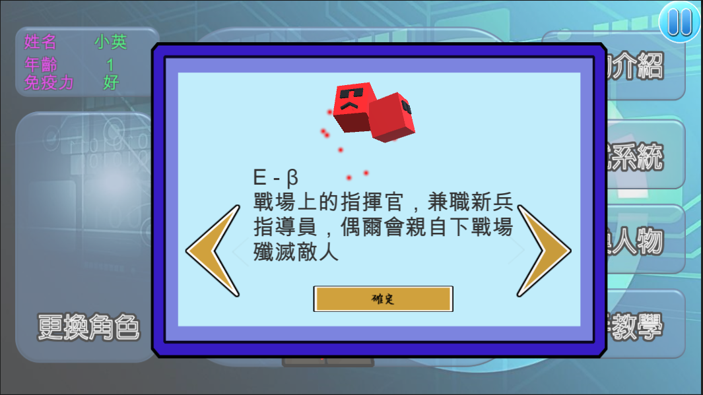
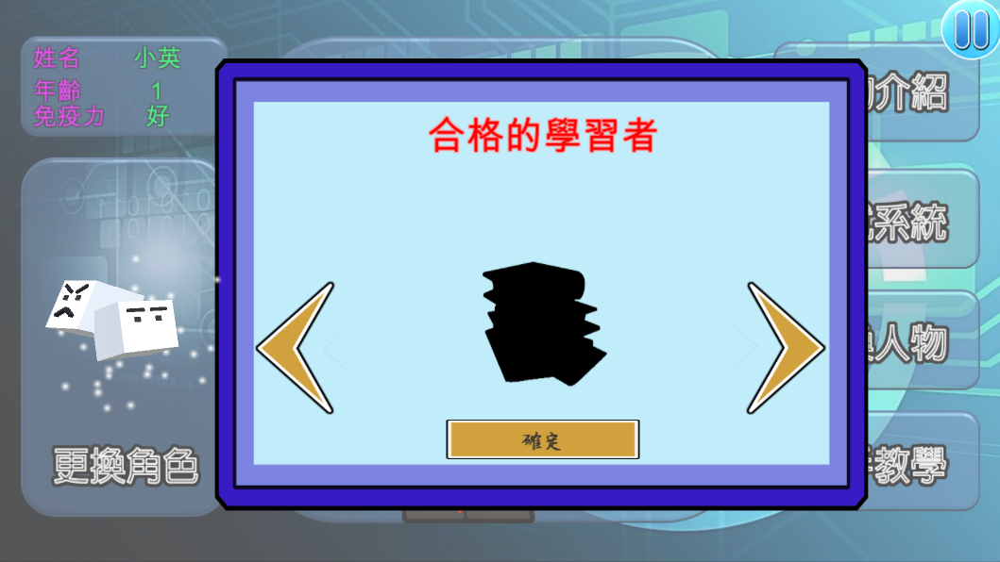
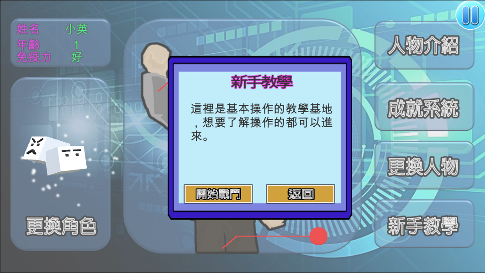
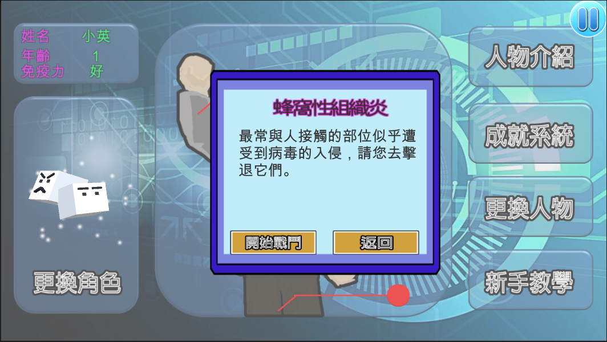
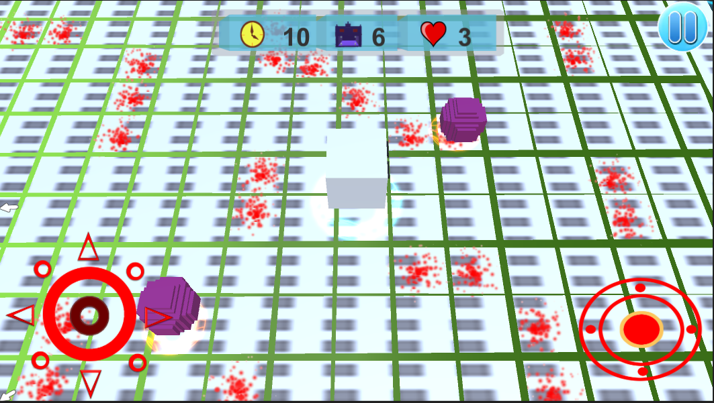
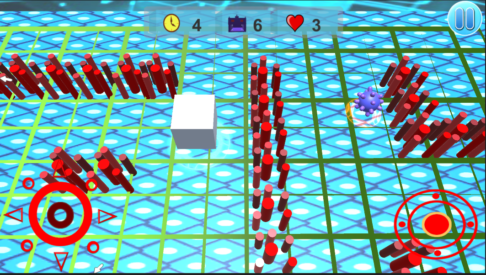
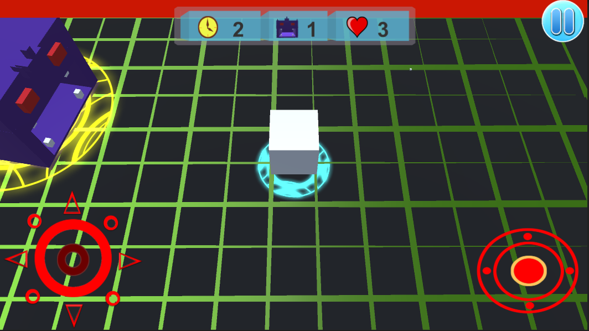
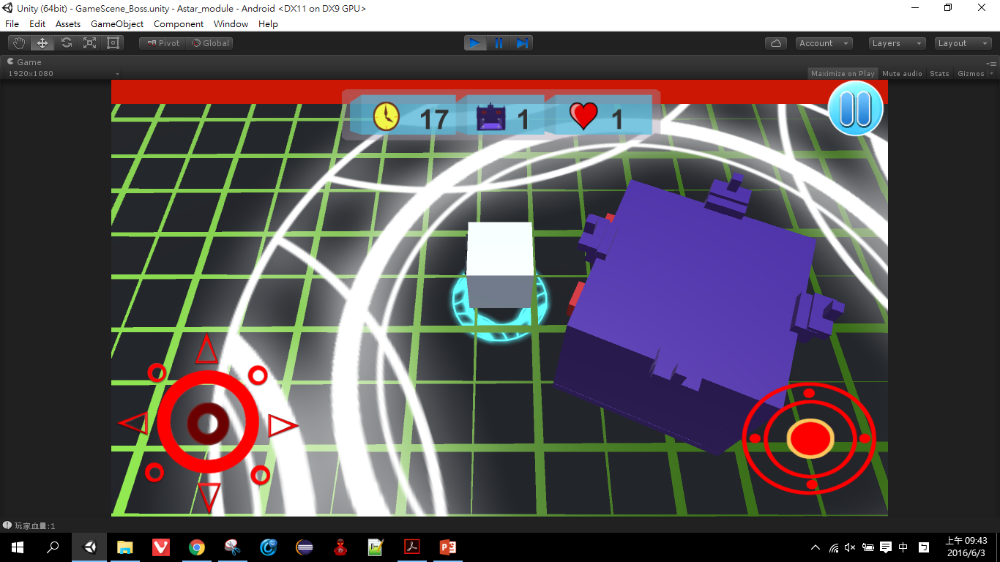

# SaveMore

## Description
An innovative mobile phone game for android, which is invented by my friend and me.

## How to Play？
In this game, you are cosplay a leukocyte / erythrocyte to against enemy(virus) in the main character.
you can use virtual joystick to controll your character move, and press the shooting button to shoot bullet toward enemy.

Once you hit them three times, enemy will dizzy and become ill, at the moment you can swallow them and threw tehm up to attack others virus(enemy).

## Demo
[SaveMoreDemo_新手教學](https://youtu.be/ob6LvOYn8Yc)

## Game Display
- Multi-Character can be choosed

- Achievement System

- Game Guides

- Different Game Stages

- Boss Room

## Game Features
- Creativity gamebackground .
- Innovative gameplay.
- AI enemy(I use A* algorithm to implement auto-follow-character and random attack mode.)

## Use Language & Packages
- Unity
- C#
- Visual Studio
